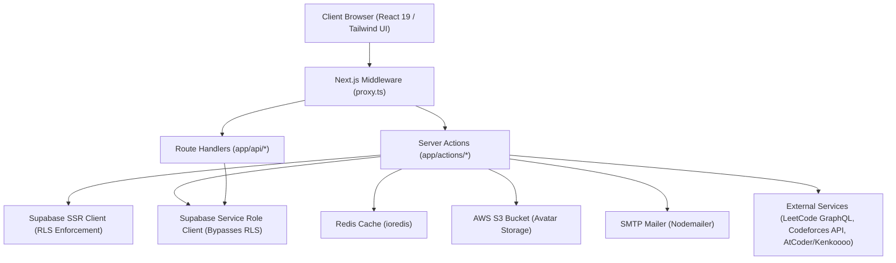
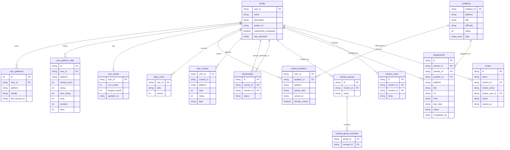
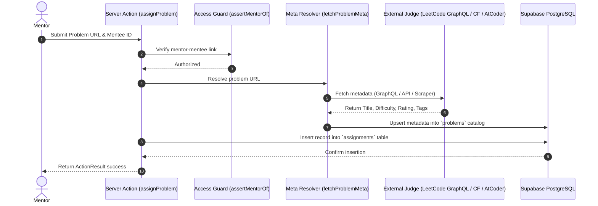

# System Architecture & Technical Documentation

## 1. System Overview

* **High-Level Purpose:** AlgoMentor is a competitive programming and Data Structures & Algorithms (DSA) tracking and mentorship platform. It consolidates solved problem counts, daily activity heatmaps, contest rating graphs, and topic gap analysis across multiple competitive programming judges (LeetCode, Codeforces, and AtCoder) into a unified dashboard. Additionally, it offers a mentorship environment allowing mentors to manage mentee rosters, organize mentees into groups, batch-assign tasks with automated verification, and issue notes.
* **Core Design Pattern:** Full-Stack Layered Architecture built on the Next.js 16 App Router with React 19. The application leverages Server Components for data fetching, Server Actions for mutations and analytics aggregation, API Route Handlers for OAuth callbacks and account management, Middleware (`proxy.ts`) for route protection and onboarding enforcement, Redis (`ioredis`) for server-side response caching, and Supabase for PostgreSQL storage and authentication.

---

## 2. Technology Stack & Dependencies

| Category | Technology / Library | Purpose in this Project |
| :--- | :--- | :--- |
| **Framework** | Next.js 16 (App Router) | Full-stack React framework providing SSR, Server Components, and Server Actions |
| **UI Library** | React 19 / React DOM 19 | Component-based UI rendering engine |
| **Language** | TypeScript 5 | Static typing across server actions, DB interfaces, and client components |
| **Styling & Fonts** | Tailwind CSS v4 / PostCSS | Utility-first CSS framework and custom font variable injection |
| **Backend / Database** | Supabase (`@supabase/ssr`, `@supabase/supabase-js`) | PostgreSQL database, Row Level Security (RLS), and authentication provider |
| **Caching / Data Store** | Redis (`ioredis`) | In-memory cache for storing public platform-wide contest schedules (`contests:upcoming`, `contests:past`) |
| **Cloud Storage** | AWS S3 SDK (`@aws-sdk/client-s3`) | Object storage for user profile avatar uploads and management |
| **Email Service** | Nodemailer | Transactional SMTP email client for sending mentorship invitation links |
| **Scraping & HTTP** | Axios & Cheerio | External HTTP requests and HTML scraping for problem metadata resolution |
| **Iconography** | React Icons & Material Symbols | Platform brand icons (LeetCode, Codeforces, AtCoder) and Material UI symbols |

---

## 3. High-Level Architecture Diagram



---

## 4. Directory & Module Structure

```
dsa-mentor/
├── app/
│   ├── actions/               # Server Actions for async backend processing
│   │   ├── analytics.actions.ts   # Solved counts, heatmaps, streak stats, contest rating history
│   │   ├── assignment.actions.ts  # Problem metadata resolution & task assignments
│   │   ├── avatar.actions.ts      # AWS S3 avatar uploads and removal
│   │   ├── contest.actions.ts     # Live & past contest retrieval across platforms (with Redis caching)
│   │   ├── group.actions.ts       # Mentee group CRUD and batch assignments
│   │   ├── mentorship.actions.ts  # User search, invitations, and mentee roster stats
│   │   ├── note.actions.ts        # Direct mentor-to-mentee notes
│   │   └── profile.actions.ts     # Platform handle mapping and onboarding updates
│   ├── api/
│   │   └── account/delete/        # Irreversible account wiping Route Handler
│   ├── auth/                  # Authentication pages and OAuth callback handler
│   ├── components/            # Shared marketing/landing page components
│   ├── dashboard/             # Core application views (Overview, Mentees, Groups, Problems, Tasks)
│   ├── invite/[token]/        # Public invite acceptance route
│   ├── lib/                   # Internal utilities, services, and system helpers
│   │   ├── account/           # Service-role account deletion procedures
│   │   ├── auth/              # Onboarding completion check helpers
│   │   ├── aws/               # AWS S3 client and object key utilities
│   │   ├── email/             # Nodemailer SMTP mailer and HTML email templates
│   │   ├── mentorship/        # Authorization guards (e.g. assertMentorOf)
│   │   ├── problemMeta/       # URL parsing, HTTP throttling, scraping, and metadata resolution
│   │   ├── redis/             # Redis client and caching helpers (getCached, setCached)
│   │   ├── supabase/          # SSR browser, server, and service-role client factories
│   │   └── types/             # Domain TypeScript interfaces (analytics, mentorship)
│   ├── onboarding/            # Profile onboarding and handle setup page
│   └── globals.css            # Global CSS styles and Tailwind imports
├── proxy.ts                   # Next.js middleware enforcing auth state and onboarding routing
├── types/
│   └── db.ts                  # Auto-generated Supabase PostgreSQL database schema types
└── package.json               # Dependency definitions and script configurations
```

---

## 5. Data Models & Database Schema



---

## 6. API Surface, Routes & Interfaces

### HTTP Route Handlers

| Method | Endpoint | Handler File | Auth Required | Description |
| :--- | :--- | :--- | :--- | :--- |
| `GET` | `/auth/callback` | `app/auth/callback/route.ts` | No | Handles OAuth code exchange for Supabase Auth and redirects to onboarding or dashboard |
| `POST` | `/api/account/delete` | `app/api/account/delete/route.ts` | Yes | Wipes all user data across PostgreSQL tables, S3 avatar prefixes, and Supabase Auth |

### Core Server Actions

| Category | Exported Action | Auth / Authorization | Description |
| :--- | :--- | :--- | :--- |
| **Analytics** | `getDashboardData(userId)` | Auth Session | Fetches consolidated profile, streak, heatmap, stats, contest rating, and topic analytics |
| **Analytics** | `getPaginatedSolvedProblems(userId, page, pageSize, filters)` | Auth Session | Returns paginated solved problems filtered by platform, difficulty, topic, or date range |
| **Assignments** | `assignProblem({ menteeId, url, dueDate, note })` | Active Mentor Guard | Resolves problem metadata from URL and inserts an assignment for a mentee |
| **Assignments** | `getAssignmentInsights(menteeId)` | Active Mentor Guard | Provides verified assignment completion statistics against actual solve history |
| **Contests** | `getUpcomingContests()` | Public / Non-Auth | Scrapes or fetches upcoming contest schedules from Codeforces, LeetCode, and AtCoder with Redis caching |
| **Mentorship** | `sendInvite({ userId, email })` | Auth Session | Generates a mentorship invitation link and sends an email via Nodemailer |
| **Mentorship** | `respondToInvite(token, accept)` | Auth Session | Accepts or declines a mentorship invite, establishing a record in `mentorships` on accept |
| **Groups** | `assignProblemToGroup({ groupId, url, ... })` | Auth Session | Resolves problem metadata once and fans out assignments to all members of a group |
| **Avatar** | `uploadAvatar(formData)` | Auth Session | Uploads an image payload to AWS S3 and updates `profile.avatar_url` |

---

## 7. Key Data Flows & Sequences

### Problem Assignment & Metadata Resolution Flow



---

## 8. Configuration & Environment Variables

| Variable Name | Required | Description |
| :--- | :--- | :--- |
| `NEXT_PUBLIC_SUPABASE_URL` | Yes | Supabase project URL for browser and server clients |
| `NEXT_PUBLIC_ANON_KEY` | Yes | Supabase public anonymous API key |
| `SUPABASE_SERVICE_ROLE_KEY` | Yes | Service-role key used to bypass RLS for cross-user mentorship analytics and account deletion |
| `REDIS_URL` | No | Redis connection URL for caching public contest schedules (defaults to `redis://localhost:6379`) |
| `NEXT_PUBLIC_APP_URL` | No | Base application URL used to construct invite links (defaults to `http://localhost:3000`) |
| `NEXT_PUBLIC_SERVER_URL` | No | External worker service URL for initiating background user syncs |
| `AWS_REGION` | Yes | AWS region hosting the S3 bucket |
| `AWS_ACCESS_KEY_ID` | Yes | AWS IAM access key ID for S3 operations |
| `AWS_SECRET_ACCESS_KEY` | Yes | AWS IAM secret access key for S3 operations |
| `AWS_S3_BUCKET_NAME` | Yes | AWS S3 bucket name storing user avatar uploads |
| `SMTP_HOST` | No | Hostname of the SMTP server for sending invitation emails |
| `SMTP_PORT` | No | Port for the SMTP server (defaults to `465`) |
| `SMTP_USER` | No | Username / email address for SMTP authentication |
| `SMTP_PASS` | No | Password / App password for SMTP authentication |
| `EMAIL_FROM` | No | Display name and address formatted for outgoing emails |
